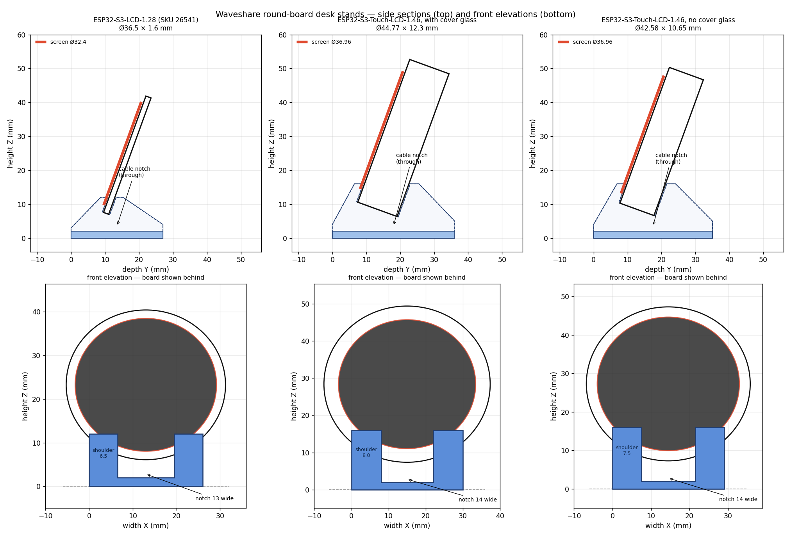

# Waveshare round-board desk stands

Minimal angled stands for Waveshare's round ESP32-S3 display boards. One design,
three sizes: a tapered wedge with a groove angled 20° back from vertical, and a
cable notch cut straight through the middle so a USB-C lead runs *through* the
stand rather than over it. The board drops in rim-first — nothing clips, nothing
flexes, no fasteners.



| board | stand | groove | notch | screen top | material |
|---|---|---|---|---|---|
| ESP32-S3-LCD-1.28 (SKU 26541) | [`stl/esp32-s3-lcd-1.28_board-36.5mm_stand.stl`](stl/esp32-s3-lcd-1.28_board-36.5mm_stand.stl) | 2.4 × 5 mm | 13 mm | 41.6 mm | 4.6 g |
| ESP32-S3-Touch-LCD-1.46, cover glass | [`stl/esp32-s3-touch-lcd-1.46-coverglass_board-44.77mm_stand.stl`](stl/esp32-s3-touch-lcd-1.46-coverglass_board-44.77mm_stand.stl) | 13.1 × 8 mm | 14 mm | 50.6 mm | 8.9 g |
| ESP32-S3-Touch-LCD-1.46, bare | [`stl/esp32-s3-touch-lcd-1.46-bare_board-42.58mm_stand.stl`](stl/esp32-s3-touch-lcd-1.46-bare_board-42.58mm_stand.stl) | 11.5 × 8 mm | 14 mm | 48.5 mm | 8.2 g |

Print flat on the base. No supports, no overhangs. Masses are PETG.

**Printable files live in [`stl/`](stl/).**

## Start here

- **[`PRINTING.md`](PRINTING.md)** — which file to print, slicer presets, plate
  orientation, how to seat each board, what the notch does and doesn't do.
- **[`BOARDS.md`](BOARDS.md)** — verified dimensions and pin maps for both
  boards, how the two sizes actually compare, and how to tell the two 1.46
  variants apart.
- **[`reference/`](reference/)** — Waveshare's own outline and pinout drawings,
  with source URLs in [`SOURCES.md`](reference/SOURCES.md).

## Three things worth knowing

1. **The 1.46 ships in two cover-glass options and they are different parts** —
   Ø44.77 / 12.30 mm thick with glass, Ø42.58 / 10.65 mm without. The grooves
   differ by 1.65 mm. Check yours before printing; see `BOARDS.md`.
2. **The notch is a cable route, not a plug socket.** It leaves 4.1–5.4 mm of
   clear space under the board rim — fine for a bare lead or a right-angle
   plug, not enough for a straight plug inserted at bottom-dead-centre. See
   `PRINTING.md`.
3. **The two boards are closer in size than they look.** The 1.46's PCB is only
   6.1 mm wider than the 1.28's. What differs enormously is thickness — 1.6 mm
   of bare PCB rim versus a 12.3 mm stack.

## Why these aren't from Printables

Nothing there targets these boards. Searches surface models for the
**ESP32-S3-Touch-LCD-1.28** (a different outline from the non-touch 1.28) or for
the bare 1.28-inch LCD module. So these are built from Waveshare's outline
drawings instead — neither product page states its dimensions in text, they
exist only inside a diagram image.

## Design

A straight groove holding a round board is the plate-stand trick: the disc
contacts the groove on two lines and cannot rock. It buys three things over a
cradle or a tripod — no supports needed, no thin snap features to fatigue, and
because the board is round you can rotate it to put the connectors where you
want them.

The solid is three slabs stacked across the width: full wedge, base slab, full
wedge. The two outer slabs carry the groove; the middle one is just the floor,
which is what makes the notch. Because the slabs share their lower boundary
exactly, the exposed face at each internal boundary is one simple polygon, so
the mesh comes out watertight without needing a general polygon boolean.
`check_stl.py` proves that rather than assuming it.

## Files

| file | what it is |
|---|---|
| `build_stands.py` | generates all three STLs from one parameter table; prints a geometry report and asserts the board fits the base, the centre of mass stays centred, the notch floor clears the groove floor, and a cable actually fits under the rim |
| `check_stl.py <f.stl>` | verifies watertightness, outward normals, no degenerate facets; exits non-zero on a problem |
| `preview.py` → `preview-all.png` | side sections and front elevations, all three at one scale, board drawn in place |
| `stand.scad` | same model, parametric, for tweaking in OpenSCAD; set `variant` at the top |
| `flatten_presets.py` | resolves an ElegooSlicer preset's `inherits` chain into one flat preset — see the automation note in `PRINTING.md` |
| `archive/` | superseded files, kept rather than deleted; see `archive/NOTE.md` |

## Regenerating

```
python3 build_stands.py
for f in stl/*.stl; do python3 check_stl.py "$f"; done
python3 preview.py
```

Pure standard library for the STL generator and validator; matplotlib only for
the previews.

## Licence

MIT — see [`LICENSE`](LICENSE).
