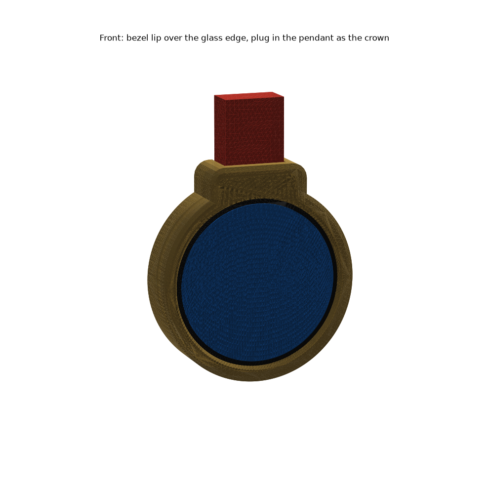
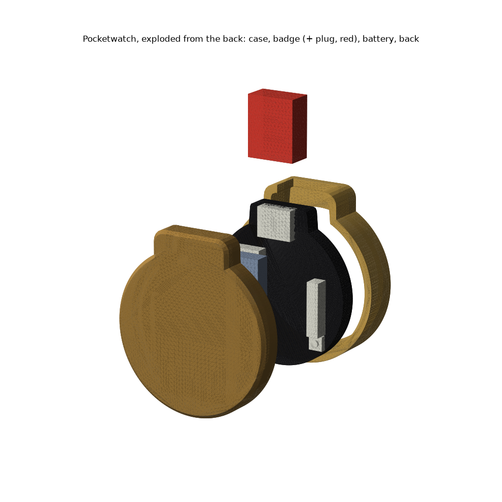
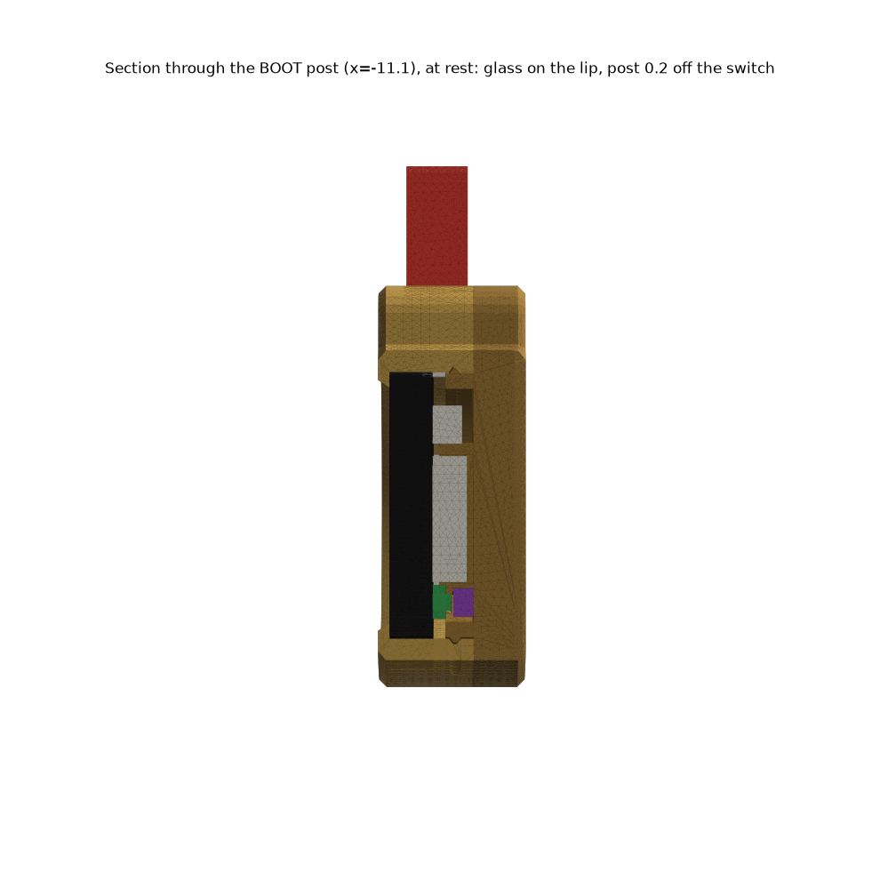
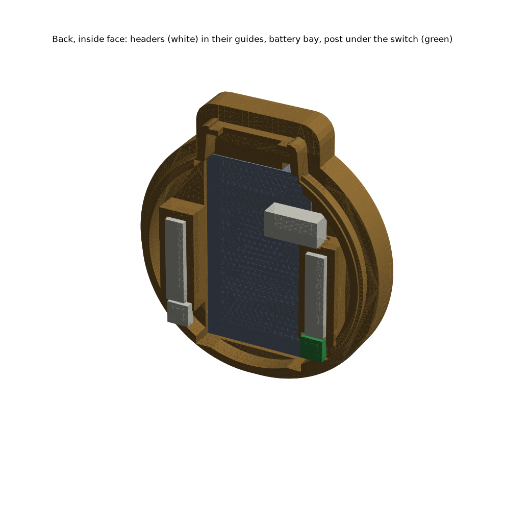
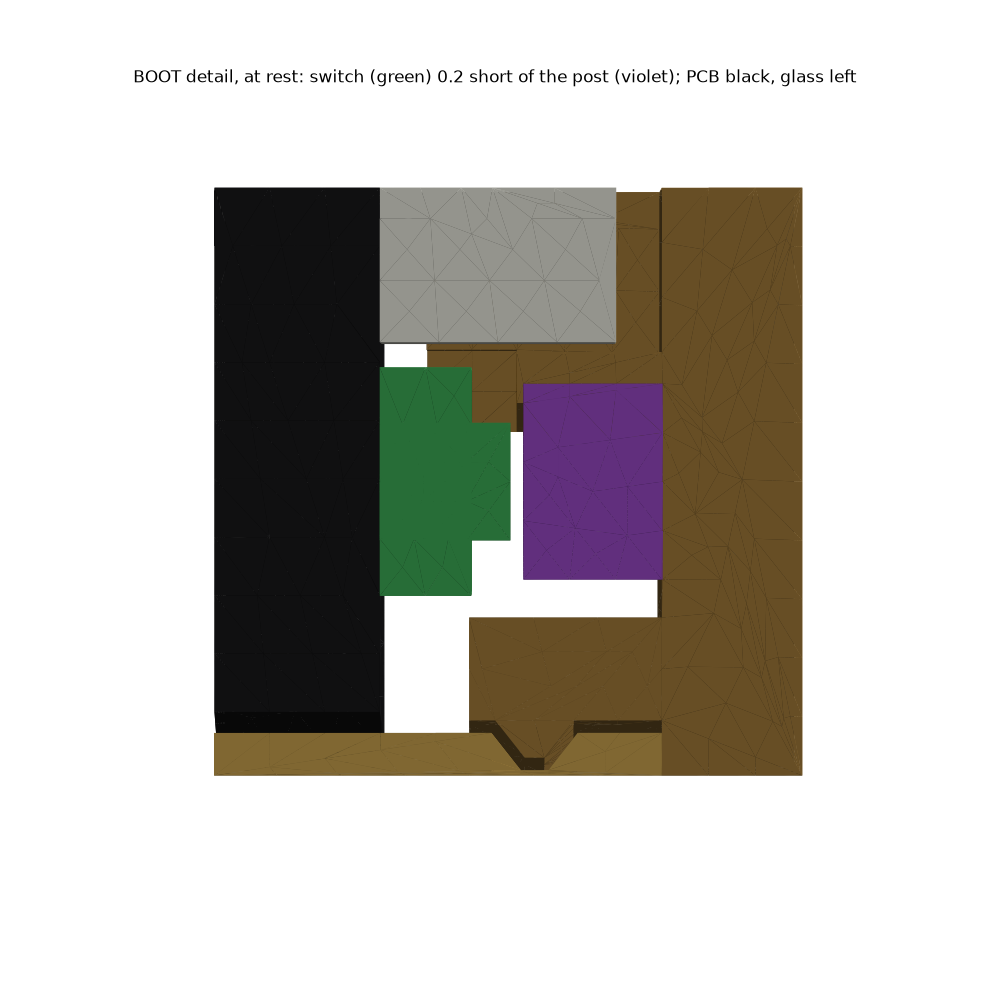
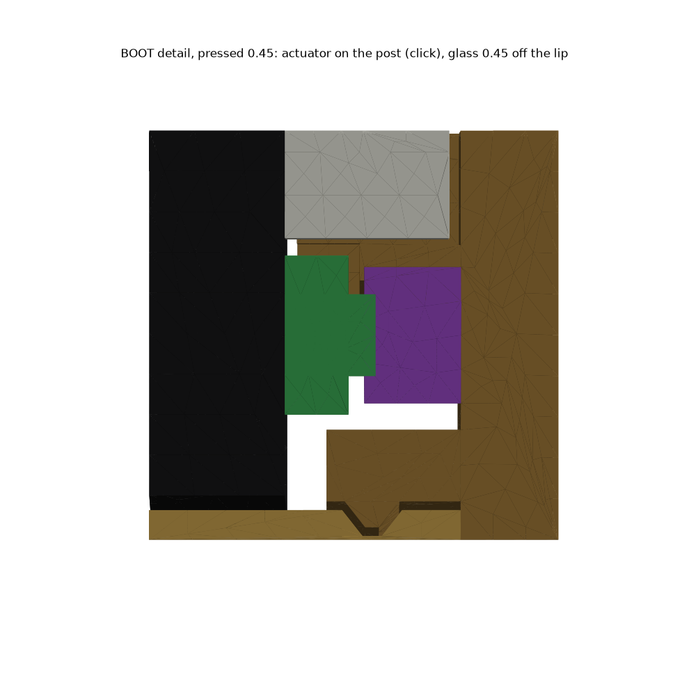

# Pocketwatch (1.28 badge)

**A round brass-look case for the 1.28 badge. Your right-angle USB-C plug is the crown and the cable is the chain. Press the screen to click BOOT.**

First version. **Not printed yet.** Several hardware numbers are still guesses (see Placeholders).

| | |
|---|---|
| **Size** | **Ø39.4 × 15.6 mm** thick, 42.9 tall with the pendant (plug not included) |
| **Parts** | [`Pocketwatch - case.stl`](<../stl/pocketwatch/Pocketwatch - case.stl>), [`Pocketwatch - back.stl`](<../stl/pocketwatch/Pocketwatch - back.stl>) |
| **Print** | Both flat side down as exported. **Case** front face on the bed, **back** outside face on the bed. No supports. |
| **Build** | `~/.venvs/cad/bin/python pocketwatch/build_pocketwatch.py` from the repo root. Fails loudly if any check fails. |

## How it works

| | |
|---|---|
| **Front** | Bezel lip overlaps the glass edge by **1.0**. The window is **33.3**, about 1 mm per side clear of the active display. |
| **Float** | The badge slides freely front to back. At rest the glass sits on the lip. |
| **Click** | Pressing slides it back. After **0.20** the BOOT switch meets a post on the back. **0.25** more and it clicks. Everything else still has **0.25** of room, so the switch is the only thing you feel bottom out. |
| **Guides** | Two pockets on the back cover take the header sockets, **0.15** per side. They locate and key the board. They don't clamp it. They engage **2.9** (**1.5** at the switch end). |
| **RESET** | Gets a clearance pocket and no post. |
| **Battery** | 401730 LiPo in a bay behind the header tops, between the guides. It sits **1.5** behind the nearest badge part, so it never takes the press. **Tape it to the bay floor.** Nothing else holds it forward. |
| **Lead** | Small notch at the battery's top end. The lead turns forward there and runs to the JST. |
| **Back** | Snaps into a groove inside the case, **0.30** interference, 45° bead. Pry it off at the seam. |

## Placeholders

The script prints these at the top of every run. Replace each one with a measurement, rebuild, and the checks tell you if anything now collides.

| name | now | measure |
|---|---|---|
| `hdr_span` | 26.0 | outside edge of H1 to outside edge of H2 |
| `tab_to_hdr` | 15.8 | tab tip down to the top end of the headers |
| `sw_x`, `sw_y` | ±11.1, −10.2 | switch centres. **BOOT is lower-left seen from the back** |
| `sw_body_h` | 1.4 | switch housing height. **The switch-end guide engagement depends on it** |
| `sw_cap_h` | 2.0 | actuator top behind the PCB back. **This sets the click** |
| `jst_*` | (−7.6, 8.5), 8.4 × 4.0 | JST position and footprint |
| `BATT_*` | 4.0 × 17 × 30 | your LiPo. Width must stay under **17.3** (gap between the guides) |
| `LEAD_X` | −6.0 | where the lead leaves the battery |
| `PLUG_W`, `PLUG_T` | 12.0, 6.5 | plug overmold at the metal |
| `PLUG_L` | 15.0 | plug overmold straight length before the bend. Must exceed the **2.25** pendant wall |

## Checks (all solids, all pass)

| check | margin |
|---|---|
| At rest, no badge part overlaps case, back or battery | 0.00 mm³. Glass touches the lip, everything else ≥ **0.15** |
| Axial room before contact: BOOT | **0.20** (= REST_CLR) |
| Axial room before contact: everything else | **0.70**, which is **0.25** past a full click |
| Pressed 0.45: BOOT into the post | 0.634 mm³ (= 0.25 travel × actuator area) |
| Pressed 0.45: everything else | clear, ≥ **0.15** sideways, ≥ **0.25** axially |
| Guide engagement | **2.92** sides and tab end, **1.52** switch end (≥ 1.5) |
| Window vs active display + 1 | **0.97** to spare |
| Snap | 17 mm³ interference one bead-height out, 0 assembled |
| Walls | all ≥ **1.2**. Thinnest: lip, skirt, guides, back 1.20; behind the groove 1.35 |
| Meshes | both watertight (`check_stl.py`) |

## Renders

| | |
|---|---|
|  |  |
|  |  |
|  |  |

## Assumptions

- The badge is a **Ø35.31 cylinder** from glass face to PCB back (4.53). You also wrote "~5". 4.53 is the caliper number.
- The **USB-C receptacle** is a standard 8.94 × 3.26 shell, centred 5.0 behind the glass, flush with the tab tip.
- The plug overmold seats **flush against the tab tip**.
- **FLOAT is 0.7, not 0.5.** At 0.5 the margin past a full click would be 0.05, below what a 0.6 nozzle holds. 0.7 is the most the switch-end guide allows at 1.5 engagement.
