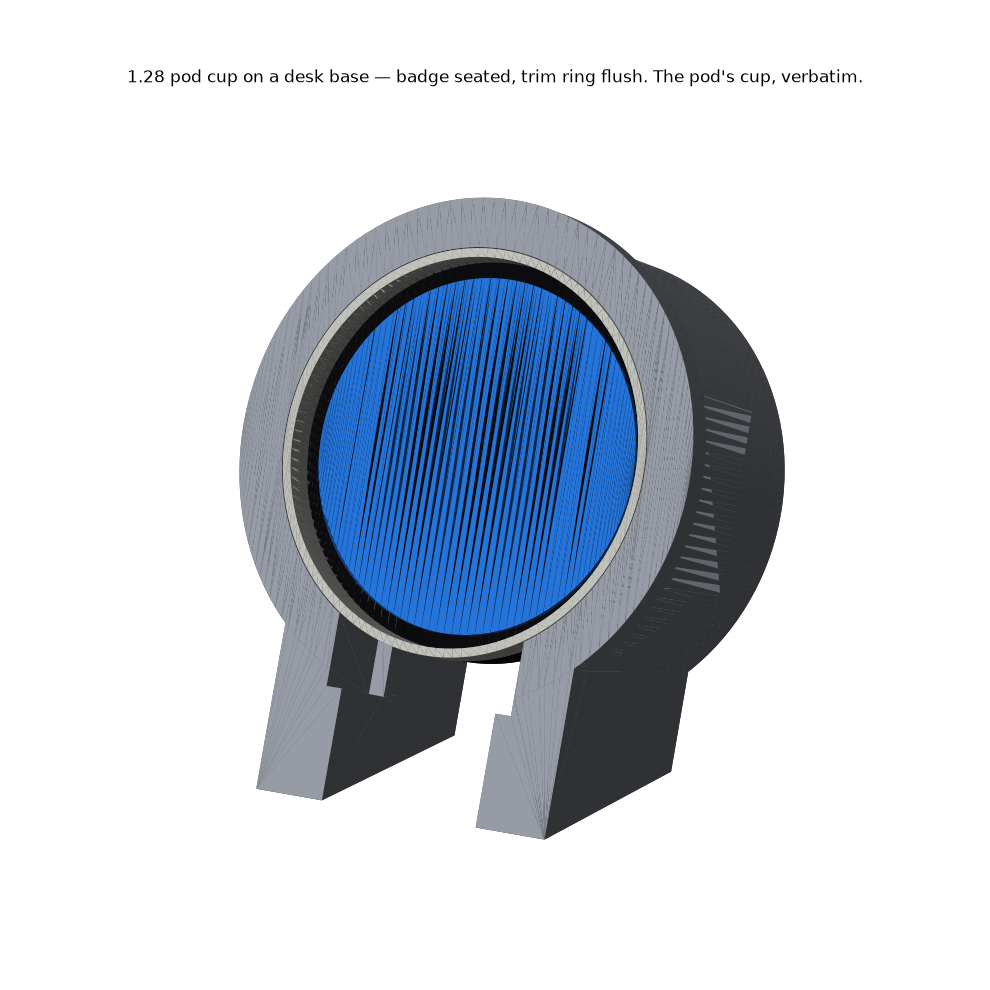
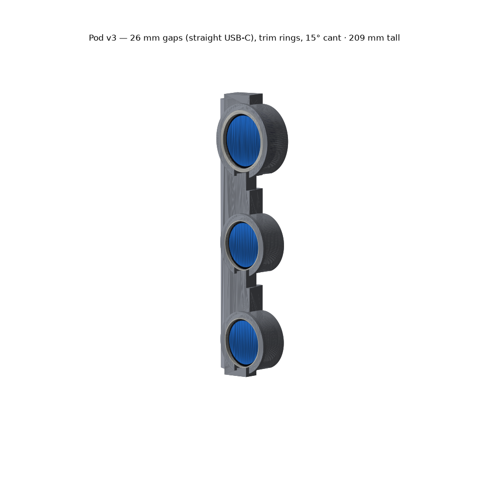
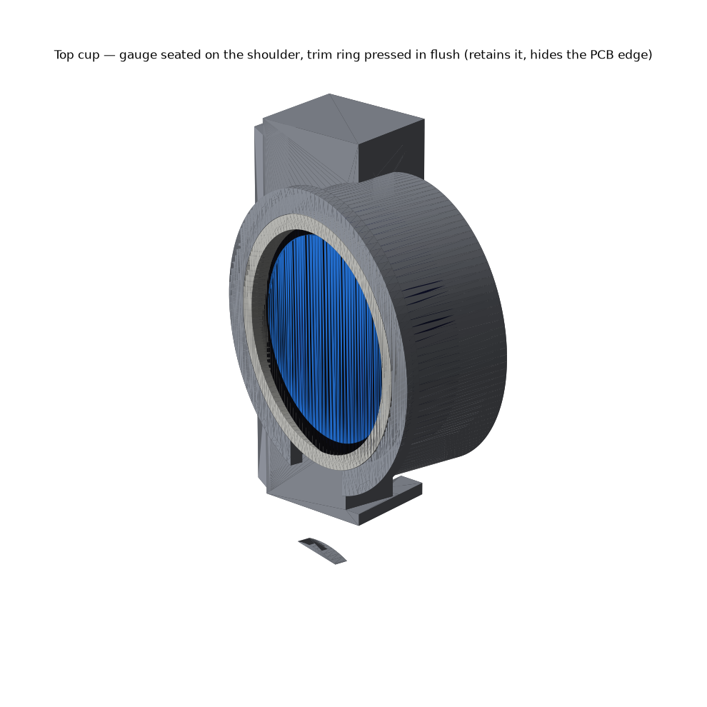
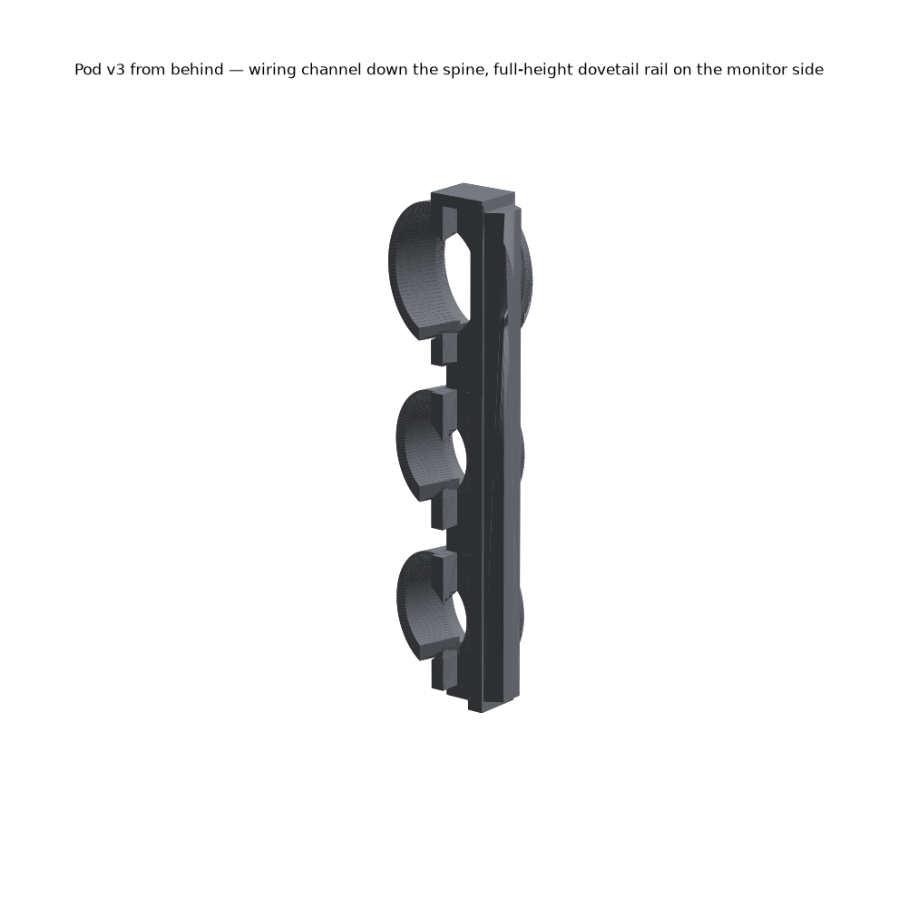
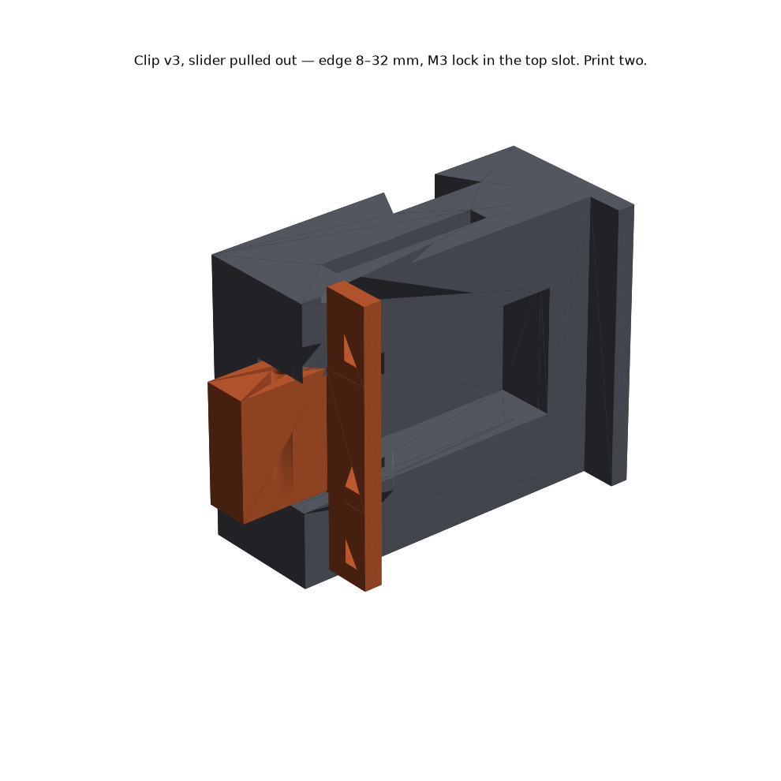
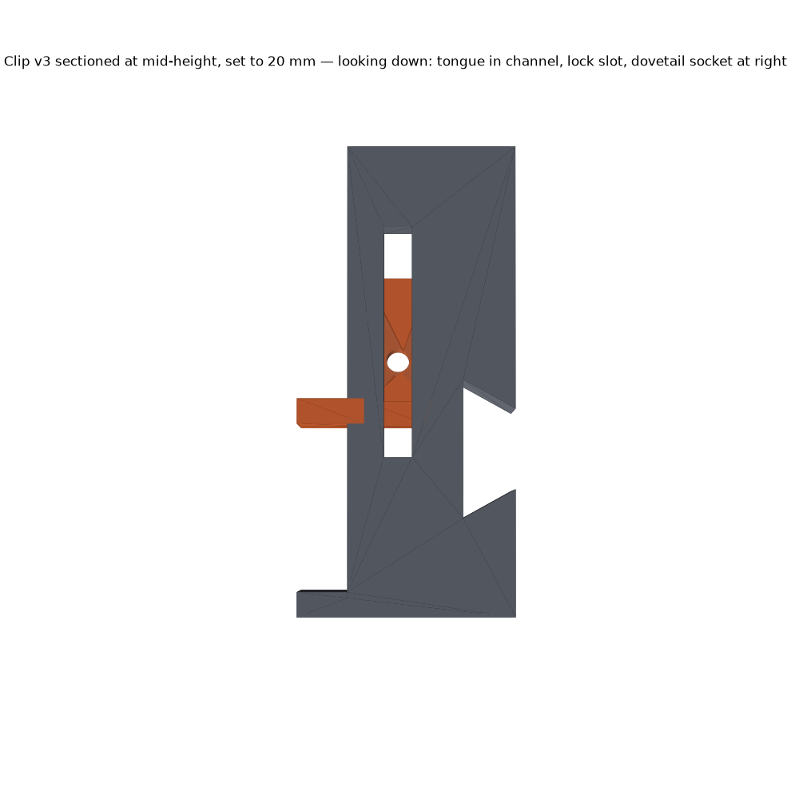
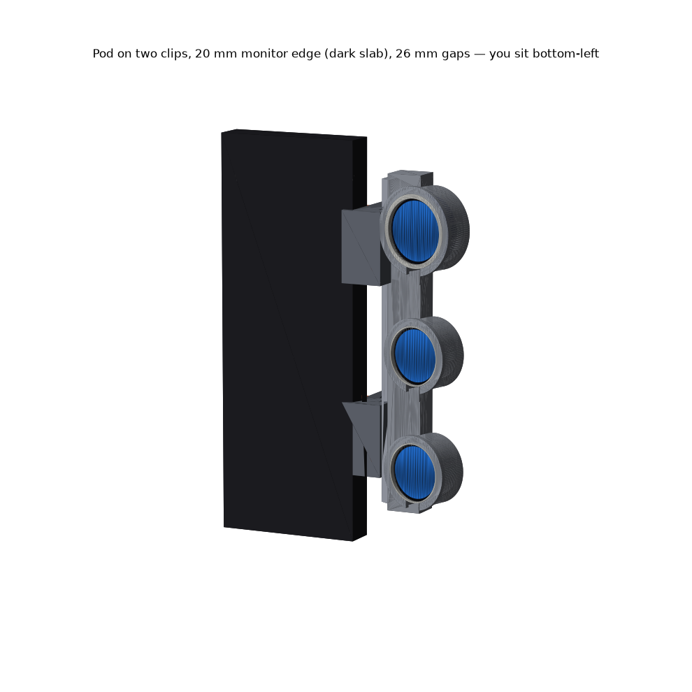

# Gauge pod — pillar-pod look, clipped to a monitor edge

Three Waveshare round displays as an instrument cluster on the side of a
monitor. The reference is a 2G DSM A-pillar pod: cylindrical cups with trim
rings, gauges canted toward the driver, stacked on a spine. Adapted to a flat
monitor edge — straight spine, adjustable clamp — the shell shape that follows
a windshield pillar isn't reproduced.

## What you print

**Test the cup first:** `stl/cup-stand-1.28.stl` + `stl/trim-ring-1.28.stl` —
one 1.28 pod cup on a desk base, ~16 g vs ~40 g for the pod. It is the pod's
cup verbatim (`cup()` in `build_pod.py`), so if the badge seats and the ring
presses in there, the pod fits. Prints face-up, no supports; stand it on its
feet to use.

**The 1.28s mount USB-C tab DOWN**, into the plug slot, same as the 1.46's port —
rotate the display 180° in firmware. The tab sticks out past the round edge, so
it can only go into the slot.

| part | qty | file | notes |
|---|---|---|---|
| pod | 1 | `stl/pod-gap12.stl` | for right-angle USB-C cables — the default. `stl/pod-gap26.stl` if you must use straight plugs |
| trim ring, 1.46 | 1 | `stl/trim-ring-1.46.stl` | press fit, retains the gauge |
| trim ring, 1.28 | 2 | `stl/trim-ring-1.28.stl` | |
| clip, fixed | **2** | `stl/clip-fixed.stl` | two clips on the full-height rail |
| clip, slider | **2** | `stl/clip-slider.stl` | |
| hardware | 2 | M3 × 12 screw | lock, one per clip; self-taps into the tongue (Ø2.8 hole), or fit a heat-set insert |

Gauges, top to bottom: **1.46 cover glass, 1.28, 1.28** — the 60/52 mixed-stack look.

## Two gap sizes — the default is for right-angle cables

The 1.46's port is on its bottom edge and fires radially. Whatever hangs from it
lands in the gap below that cup, so the gap is sized by the plug.

| | `pod-gap12` (default) | `pod-gap26` |
|---|---|---|
| cable | **right-angle** plug, head ~12 × 6.5 × 9 mm | **straight** plug, ~24 mm body |
| rim-to-rim gap | 12 mm | 26 mm |
| height | **181 mm** | 209 mm |
| volume | 79 cm³ | 89 cm³ |

Both fit the Centauri Carbon 2 bed (256 mm).

## How the gauges are held

Each cup is a tube with a **shoulder** behind the gauge and a **rear bore** the
back of the board passes through. A **trim ring** presses into the pocket in
front of the gauge, flush with the cup face — it's what stops the gauge falling
out forward, and it hides the PCB edge like a bezel.

- **1.46** — its cover glass overhangs the PCB by 1.1 mm all round. The shoulder
  grips *that*, and the bore is snug on the Ø42.58 PCB, so the whole 12 mm stack
  and its three brass standoffs pass straight through. The ring covers the glass
  edge out to Ø40.
- **1.28** — the shoulder grips the bare PCB rim; the bore (Ø33) clears its
  BOOT/RESET buttons and lets the header pins protrude into the spine.

Rings are 0.1 mm oversize. If one won't press in, sand; if loose, a dot of CA.

## Wiring

Each cup has a **16 mm drop slot** at its bottom for the right-angle plug head.
Right-angle USB-C cables come in two flavours — cable exiting **sideways**
(along the plug's wide axis) or **backward** (along its narrow axis) — and the
pod accepts either: a **pass-through** at each drop slot leads into the
**wiring channel down the back of the spine**, so the lead ducks in whichever
way it leaves the plug. Orient a backward-exit plug so the cable heads toward
the monitor, not toward you. The channel is open to the rear, hidden from you,
and exits at the bottom.

## The clip — adjustable, 8–32 mm edges

A C-clamp: fixed front jaw (6 mm lip onto the bezel), spine, and a **sliding
rear jaw on a tongue**. Set it to your edge, drop an M3 through the slot in the
top into the tongue, tighten — the screw head bears on the spine and lifts the
tongue against the channel roof. Dovetail socket on the outer face carries the
pod; the pod's rail is full height, so **two clips** go anywhere along it and
the pod slides to the height you want.

Renders also exist for 10 mm and 30 mm edges (`renders/04-assembly-*`).

## Printing

- **Pod: lying on its back** (spine's rear face on the bed). Cups become
  vertical cylinders — no supports. The wiring channel becomes a 12 mm bridge on
  the bed side; PETG handles it. The dovetail flanks are 60°, self-supporting.
- **Clips: fixed part on its outer (+X) face**, slider on its side.
- **Rings: flat.**
- Same PETG / 0.6 nozzle / 0.3 mm layer as the stands. Pod at 15 % infill is
  ~35–40 g printed, not the solid-volume figure above.

## Geometry notes

- Cups are canted **15°** about vertical toward you (the pod is drawn for the
  monitor's **right** edge; mirror for the left).
- Cup faces sit **6 mm proud of the screen plane** when mounted.
- Everything is generated by `build_pod.py` (manifold3d + trimesh, in the
  `~/.venvs/cad` venv). `render.py` does the pictures headlessly. Change a
  number, re-run: `~/.venvs/cad/bin/python build_pod.py` (gap12) and `… 26`.

## Still open

- Nothing printed yet. The ring press fit and the clip's tongue clearance are
  the two numbers most likely to need a tweak after the first print.
- The 12 mm gap assumes a right-angle head no deeper than ~9 mm radially. If
  yours is chunkier, `GAP` in `build_pod.py` is the one number to raise.
- No fillets where the cups meet the spine — manifold3d has no fillet op. It
  prints fine; it just looks crisper than a moulded pod.
